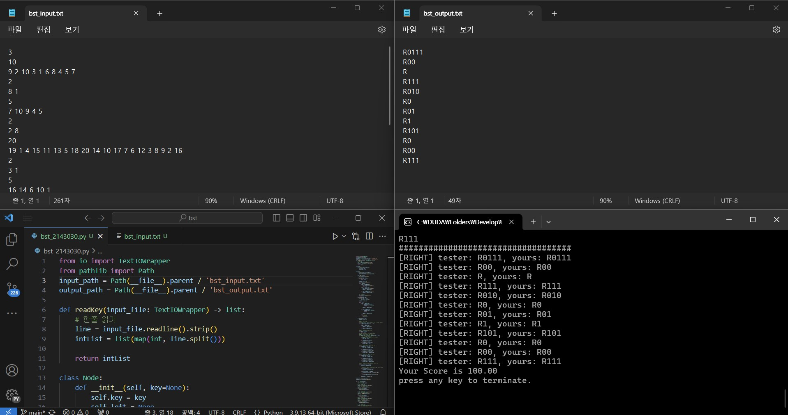

<h1 style = "text-align : center;"> BST 리포트</h1>
<div style="font-weight : bold; text-align : right; font-style : italic;">2143030 황진석</div>

## **1. 코드설명**
> ***상대경로***
```python
from pathlib import Path
input_path = Path(__file__).parent / 'bst_input.txt'
output_path = Path(__file__).parent / 'bst_output.txt'
``` 

bst_input.txt / bst_output.txt 를 읽을 때 상대 경로로 읽기 위해 pathlib를 사용했습니다.

<br>

> ***Node 클래스***   
```python
class Node:
    def __init__(self, key=None):
        self.key = key
        self.left = None
        self.right = None
```
키 값과 왼쪽, 오른쪽 자식의 레퍼런스를 가지는 클래스입니다.   

<br>

> ***Bst 클래스***    
* ***생성자와 소멸자***
```python
class Bst:
    def __init__(self, output_path):
        self.root = None
        self.output_file = open(output_path, 'a')
    
    def __del__(self):
        self.output_file.close()
```
Bst트리 객체를 생성할 때 bst_output.txt파일을 append 모드로 열고 객체가 소멸할 때 닫습니다.


* ***키 검색 함수 search(key)***
```python
def search(self, key):
        if self.root is None:
            return False
        
        cmpNode = self.root
        self.output_file.write("R")

        while cmpNode:
            if key == cmpNode.key:
                self.output_file.write("\n")
                return True
            
            if key < cmpNode.key:
                self.output_file.write("0")
                cmpNode = cmpNode.left
            
            elif key > cmpNode.key:
                self.output_file.write("1")
                cmpNode = cmpNode.right
        
        # 검색 실패시
        self.output_file.write("\n")
        return False
```   
아래와 같은 상황에서 False를 반환합니다.
1. 트리에 노드가 없을 때
2. 인자로 준 key가 트리에 없을 때

검색을 성공 한 경우 True를 리턴합니다.   
   
트리의 루트노드부터 검색을 시작하며, 검색 시작 시 bst_output.txt에 "R"을 입력합니다.   
True를 반환 할 때까지의 경로로 "0" 또는 "1"을 bst_output.txt에 입력합니다.   
비교노드보다 키 값이 작으면 "0", 크면 "1"을 입력합니다.  

* ***키 삽입 함수 insert(key)***
```python
def insert(self, key):
        if self.root is None:
            self.root = Node(key)
        
        cmpNode = self.root

        while True:
            if key < cmpNode.key:
                if cmpNode.left is None:
                    cmpNode.left = Node(key)
                    return
                
                cmpNode = cmpNode.left
            
            elif key > cmpNode.key:
                if cmpNode.right is None:
                    cmpNode.right = Node(key)
                    return
                
                cmpNode = cmpNode.right
            
            else:
                # 삽입 실패
                return False
```
루트노드가 없을 경우 key값을 가진 노드객체를 만들어 루트노드로 지정합니다.   
만약 key값이 이미 트리에 있을 경우 삽입 실패이므로 False를 반환합니다.  
    
그 외의 경우 루트노드를 비교노드로 설정 후 키값과 비교노드를 비교하여,   
키가 들어갈 위치를 찾아 새로운 노드 객체를 생성합니다.

* ***노드 삭제 함수 delete(key)***
```python
def delete(self, key):
        parent = None
        cmpNode = self.root

        # 삭제할 노드 찾기
        # cmpNode = 삭제할 노드 | parent는 삭제할 노드의 부모노드
        while cmpNode and cmpNode.key != key:
            parent = cmpNode

            if key < cmpNode.key:
                cmpNode = cmpNode.left
            
            elif key > cmpNode.key:
                cmpNode = cmpNode.right

        # 삭제할 키가 트리에 없는 경우
        if cmpNode is None:
            return False
        
        # 여기서부터는 삭제할 노드가 트리에 있음
        # 삭제할 노드가 자식이 없는 경우
        if cmpNode.left is None and cmpNode.right is None:
            # 삭제할 노드가 루트인 경우
            # 이걸안하면 parent가 None이여서 오류가 남
            if cmpNode is self.root:
                self.root = None
            
            elif cmpNode == parent.left:
                parent.left = None
            
            elif cmpNode == parent.right:
                parent.right = None
        
        # 삭제할 노드가 오른쪽 자식만 있는 경우
        elif cmpNode.left is None:
            if cmpNode == self.root:
                self.root = cmpNode.right
            
            elif cmpNode == parent.left:
                parent.left = cmpNode.right
            
            elif cmpNode == parent.right:
                parent.right = cmpNode.right
        
        # 삭제할 노드가 왼쪽 자식만 있는 경우
        elif cmpNode.right is None:
            if cmpNode == self.root:
                self.root = cmpNode.left
            
            elif cmpNode == parent.left:
                parent.left = cmpNode.left
            
            elif cmpNode == parent.right:
                parent.right = cmpNode.left
        
        # 삭제할 노드가 두 개의 서브트리를 가지는 경우
        else:
            successorParent = cmpNode
            successor = cmpNode.right

            # successor를 오른쪽 서브트리의 제일 작은 노드로 바꿈.
            while successor.left:
                successorParent = successor
                successor = successor.left
            
            if successorParent == cmpNode:
                successorParent.right = successor.right

            else:
                successorParent.left = successor.right
        
            cmpNode.key = successor.key
```
**parent** : 삭제할 노드의 부모 노드입니다.   
**cmpNode** : 삭제할 노드입니다.   

while 반복문으로 삭제할 노드와 그 부모 노드를 설정합니다.   
만약 key값이 트리에 없다면 False를 반환합니다.   

삭제할 노드가 트리에 있는 경우 다음 세가지 경우 중 하나의 방법으로 노드를 삭제합니다.
1. ***삭제할 노드가 자식이 없는 경우***   
노드가 루트인 경우에는 루트 노드를 None으로 만듭니다.   
그 외의 경우에는 부모 노드의 왼쪽, 오른쪽 자식 노드의 키 값과 삭제할 노드의 키 값에 따라   
부모 노드의 왼쪽 혹은 오른쪽 자식을 None으로 만듭니다.    

2. ***삭제할 노드가 자식 노드 1개를 가지는 경우***   
삭제할 노드가 루트 노드인 경우 삭제할 노드의 자식을 루트 노드로 만듭니다.   
그 외의 경우 삭제할 노드의 부모 노드에 삭제할 노드의 자식노드를 답니다.   

3. ***삭제할 노드가 자식 노드 2개를 가지는 경우***   
***successor*** : 삭제할 노드의 오른쪽 자식 서브트리중 가장 작은 값.   
***successorParent*** : successor의 부모노드   
<br>만약 successor의 부모 노드가 삭제할 노드인 경우 부모노드의 오른쪽 자식을 successor의   
오른쪽 자식으로 바꾸고 삭제할 노드 즉 cmpNode의 키 값을 successor와 바꾼다.   
그 외의 경우 successor의 부모의 왼쪽 자식을 successor의 오른쪽 자식으로 바꾼뒤,   
삭제할 노드의 키 값을 successor의 키값으로 바꾼다.   

<br>

> ***한줄 읽기 함수 readKey(input_file)***

```python
def readKey(input_file: TextIOWrapper) -> list:
    # 한줄 읽기
    line = input_file.readline().strip()
    intList = list(map(int, line.split()))

    return intList
``` 
input_file 즉 bst_input.txt에서 한 줄을 읽어 공백 단위로 숫자를 구분하여 리스트로 만들고 그 리스트를 반환합니다.

> ***메인 코드***
```python
input_file = open(input_path, 'r')

caseNum = int(input_file.readline())

# 이미 bst_output.txt가 있을 경우 그 파일 내용을 비움
file_clear = open(output_path, 'w')
file_clear.close()
```

***input_path*** : bst_input.txt를 읽기 모드로 엽니다.   
***caseNum*** : bst_input.txt의 첫번째 줄, 즉 테스트 케이스 수를 int형으로 저장합니다.   

Bst객체를 생성할 때 appeend모드로 파일을 쓰기 때문에 이미 bst_output.txt가   
있는 경우 이상한 결과가 생길 수 있습니다. 이를 방지하기 위해 bst_output.txt를 write모드로 열고 닫아서 내용을 비워줍니다.   

```python
for n in range(caseNum):
    # 트리 객체 생성
    tree = Bst(output_path)

    # 삽입할 키의 개수
    keyNum = int(input_file.readline())
    # 삽입할 키를 가진 리스트
    keyList = readKey(input_file)
    # 키 삽입
    for i in range(keyNum):
        tree.insert(keyList[i])

    # 검색할 키의 개수
    keyNum = int(input_file.readline())
    # 검색할 키를 가진 리스트
    keyList = readKey(input_file)
    # 키 검색
    for i in range(keyNum):
        tree.search(keyList[i])
    
    # 삭제할 키의 개수
    keyNum = int(input_file.readline())
    # 삭제할 키를 가진 리스트
    keyList = readKey(input_file)
    # 키 삭제
    for i in range(keyNum):
        tree.delete(keyList[i])
    
    # 검색할 키의 개수
    keyNum = int(input_file.readline())
    # 검색할 키를 가진 리스트
    keyList = readKey(input_file)
    # 키 검색
    for i in range(keyNum):
        tree.search(keyList[i])

input_file.close()
```
각 테스트 케이스마다 ***tree***라는 Bst객체를 새로 생성합니다.   
***keyNum*** : 삽입, 검색, 삭제할 키의 개수입니다.

bst_input.txt의 내용에 맞춰 키를 삽입, 검색, 삭제, 검색을 합니다.   
각 동작을 수행할 때 keyNum만큼 반복하여 동작을 수행합니다.   

모든 작업이 끝난후 input_file.close()를 사용하여 파일을 닫아줍니다.

## **2. 스크린샷**


## **3. 어려웠던 점**
Bst의 delete(key)를 구현할 때 힘들었습니다.   
처음 구현 할 때 삭제할 노드의 부모노드가 None인 경우, 즉 삭제할 노드가 루트 노드인 경우   
를 따로 작성해놓지 않아서 한참을 헤맸습니다.   
그래서 노드를 삭제를 하는 방법 3가지(자식의 개수가 0, 1, 2)에 삭제할 노드가 루트 노드인 경우를 다 구현했다가,   
마지막 경우 즉 삭제할 노드의 자식이 2개인 경우에는 따로 successor와 successorParent를 구현하여 문제를 해결했습니다.    
   
또 테스트 케이스마다 새로운 트리 객체를 만들어야 함으로 새 트리 객체에 어떻게 bst_output.txt를 연결시켜 줄지에 대한 고민도 많았습니다.   
결국 트리 객체의 생성자와 소멸자에 파일 열고 닫기를 구했습니다.   